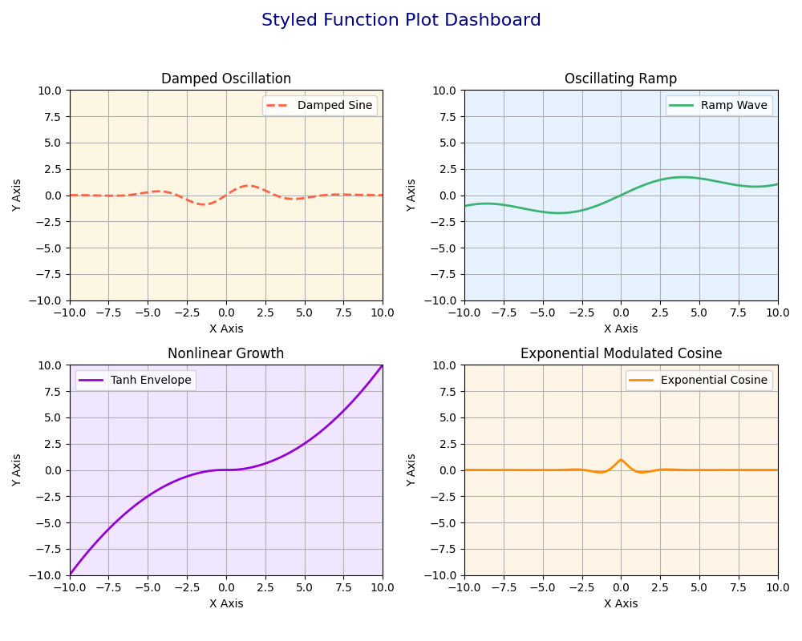

# Styled Function Plot Dashboard

This project generates a 2×2 grid of mathematical plots using customized functions and unique subplot styles. It demonstrates how to combine mathematical creativity with `matplotlib` layout and design features.

## 📊 Features
- Each subplot displays a different type of custom curve:
  - **Damped Sine Wave**
  - **Oscillating Ramp Function**
  - **Tanh Quadratic Envelope**
  - **Exponential Modulated Cosine**
- Custom subplot backgrounds, gridlines, axis limits, and legends
- Uniform axis formatting and color coding
- Clean layout with a shared figure title

## 🧠 Learning Objectives
- Practice function design beyond basic `sin/cos`
- Apply subplot formatting and styling
- Use `numpy` and `matplotlib` to generate publication-style dashboards

## 🚀 How to Run
```bash
python styled_dashboard.py
```

## 📷 Output Preview



## 📦 Requirements
- Python 3.x
- `matplotlib`
- `numpy`

## 💡 Future Ideas
- Add user input for function type selection
- Enable export to PNG or PDF format
- Interactive GUI version (Tkinter or Streamlit)

## 👩‍💻 Author
Nasim Bayati

---
This project was created independently for creative learning and public sharing. It avoids reuse of any assignment visuals or academic templates.
